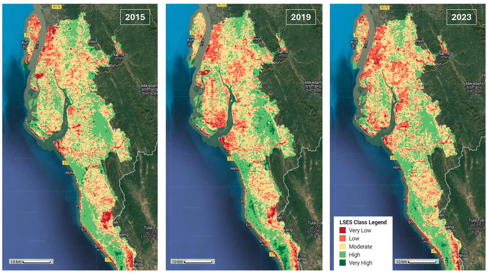

# Remote Sensing Ecological Index (RSEI) using Landsat 8 and Google Earth Engine

## 🛠️ Project Overview
Cox's Bazar, home to the world's largest refugee settlement, has experienced an unprecedented ecological strain since the 2017 Rohingya refugee crisis. The rapid deforestation for shelter, firewood, and infrastructure, coupled with increased waste generation and soil erosion, has significantly disrupted the region's fragile ecosystem. Later, from 2018, there had been some small-scale reforestation programs carried out to improve the ecological conditions of the camp area.

The Remote Sensing Ecological Index (RSEI) is an essential tool for assessing these environmental impacts. By analyzing key ecological indicators such as vegetation cover, surface temperature, wetness, and soil conditions, RSEI aids policymakers in:

✅ Monitoring ecological changes over time  
✅ Implementing sustainable land management practices  
✅ Evaluating the effectiveness of restoration efforts  

## Overview
This project calculates the **Remote Sensing Ecological Index (RSEI)** using **Landsat 8** imagery in **Google Earth Engine (GEE)**. The RSEI is a composite index derived from multiple ecological parameters to assess environmental quality. The workflow includes **data preprocessing, ecological index calculations, standardization, Principal Component Analysis (PCA), and classification into five ecological stress levels**.

## Methodology
### Data Collection
- Landsat 8 Collection 2 Level 2 imagery from Google Earth Engine (GEE)
- Best growth season imagery (August – November)
- Masking cloud shadows and water bodies using **QA_PIXEL** and **NDWI**

# Calculation of Ecological Indices

## RSEI Computation
RSEI is computed using four key ecological indicators:

1. **Normalized Difference Vegetation Index (NDVI)** - Measures vegetation health:
   \[
   NDVI = \frac{NIR - Red}{NIR + Red}
   \]

2. **Land Surface Temperature (LST)** - Derived using:
   \[
   LST = \frac{TB}{1 + (0.00115 \times \frac{TB}{1.438}) \times \ln(\epsilon)} - 273.15
   \]

3. **Wetness Index (WET)** - Extracted using Tasseled Cap Transformation:
   \[
   Wet = 0.3283 \times Red + 0.3407 \times NIR + 0.1511 \times Blue + 0.1973 \times Green - 0.7171 \times SWIR1 - 0.4559 \times SWIR2
   \]

4. **Normalized Difference Built-up Soil Index (NDBSI)** - Measures urban expansion:
   \[
   NDBSI = \frac{(RED + SWIR1) - (NIR + BLUE)}{(RED + SWIR1) + (NIR + BLUE)}
   \]

## Data Standardization
- Each index is **normalized to a range of [0,1]**.
- Standardized using **mean and standard deviation** calculations.

## Principal Component Analysis (PCA)
- **PCA is applied** to extract dominant environmental trends.
- **First principal component (PC1) accounts for ~80%** of dataset variation.
- **RSEI is obtained by normalizing PC1**:
   \[
   RSEI = \frac{PC1 - PC1_{min}}{PC1_{max} - PC1_{min}}
   \]

## Classification of RSEI
RSEI values are categorized into five ecological stress levels:

| RSEI Range  | Stress Level |
|-------------|-------------|
| 0.0 - 0.2   | Very Low    |
| 0.2 - 0.4   | Low         |
| 0.4 - 0.6   | Moderate    |
| 0.6 - 0.8   | High        |
| 0.8 - 1.0   | Very High   |

This classification helps assess **urbanization effects, land degradation, and reforestation success**.

## Features
- **Google Earth Engine (GEE) for cloud-based analysis**
- **Landsat 8 Collection 2 Level 2 data processing**
- **Automated masking of clouds, shadows, and water bodies**
- **Computation of ecological indices (NDVI, LST, Wetness, NDBSI)**
- **Principal Component Analysis (PCA) to derive RSEI**
- **Classification of RSEI into five environmental stress levels**
- **Visualization and histogram plotting in GEE**

## Results
- **RSEI Map**: Visual representation of environmental quality.
- **Classified RSEI**: Five stress levels for easy interpretation.
- **Histogram Analysis**: Distribution of RSEI values across the AOI.

## Prerequisites
- **Google Earth Engine (GEE) account**
- Basic knowledge of **JavaScript** for GEE scripting
- Familiarity with **remote sensing indices and PCA**

## How to Use

### 📜 Code Repository
You can find the complete script for this project in the GitHub repository:

➡️ **[GitHub Repository Link](https://github.com/rezaulhasan-gis/GEE-RSEI-Analysis/blob/main/GEE_code.js)**

### Steps to Run
1. **Open Google Earth Engine** and create a new script.
2. **Copy and paste the code** into the GEE script editor.
3. **Modify AOI and date range** as needed.
4. **Run the script** to generate the RSEI map and classification.

---

This version improves readability, correctly formats the equations in LaTeX, and ensures proper Markdown syntax for GitHub. Let me know if you need further refinements! 🚀

## Output

## References
- Xu, H. (2013). Remote sensing evaluation index for ecological quality assessment.
- Landsat 8 Science Team (2013). Surface Reflectance and Radiometric Correction.
- Haque, M.R. et al. (2024). "Land Use Transition and Ecological Consequences: A Spatiotemporal Analysis in South-Eastern Bangladesh."

## License
This project is open-source and licensed under the **MIT License**.

---

### Author

*Your Name Here*

📌 **Contributions are welcome!** Feel free to fork, modify, and improve this repository.

